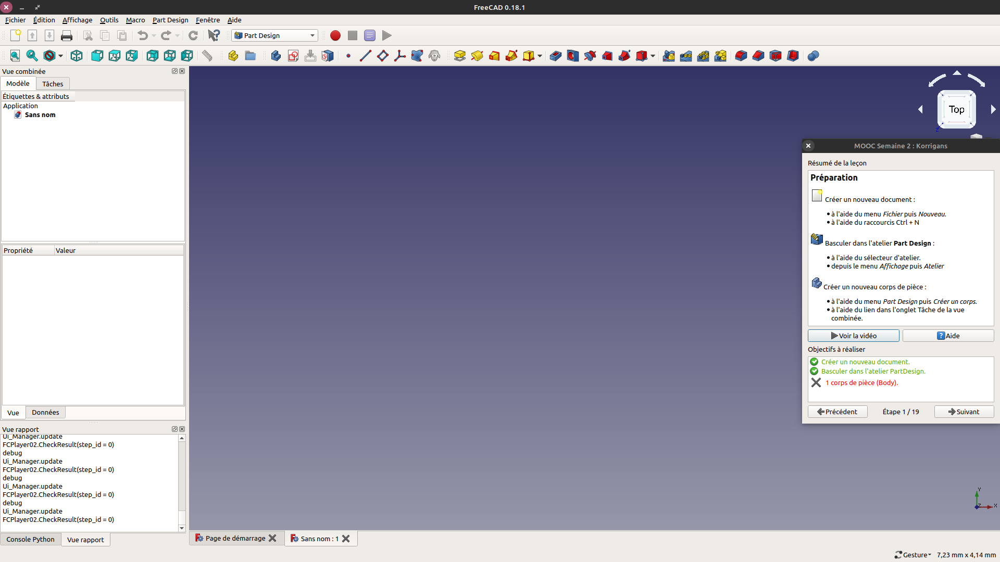

# MOOC-Workbench

Il ne s'agit pas d'un tuto sur FreeCAD, mais d'un cours sur la modélisation 3D. FreeCAD n'est
ici qu'un outil support du propos. L'intérêt porté par l'apprenant pour le sujet ou l'amusement
qu'il procure, doit être le moteur de découverte de FreeCAD.

# Sommaire
*  [Utilisation](https://framagit.org/freecad-france/mooc-workbench#utilisation)
*  [Installation](https://framagit.org/freecad-france/mooc-workbench#installation)

# Utilisation

L'atelier est disponible depuis le sélecteur d'atelier 

L'atelier MOOC propose 2 outils :

*   MOOC Player qui permet de lancer les tutoriels interactifs.

*   MOOC Grader qui permet de faire une évaluation d'un exercice.

### MOOC Player

Accessible depuis le menu **MOOC** puis **Choisir la leçon**.

Une fenêtre s'ouvre et permet de choisir quel tutoriels voir.
Sélectionner un élément de la liste puis cliquer sur OK pour éxecuter la leçon.

Une nouvelle fenêtre s'ouvre et permet de suivre le tutoriel étape par étape.
Le résumé de la leçon explique comment atteindre les objectifs de l'étape en cours.
Le bouton **Voir la vidéo** joue la vidéo de l'étape en cours dans votre navigateur internet.
Le bouton **Aide** vous affichera les liens vers la documentation des outils à utiliser. (#TODO)

Les objetifs à réaliser bascule de rouge à vert lorsque l'objectif est atteint.
L'idée c'est d'avoir tous les objectifs au vert pour passer à l'étape suivante.

Les boutons précédent vous permette de changer d'étapes, entre les deux boutons vous pouvez voir à quelle étape vous êtes et combien il y en a au total.

### MOOC Grader

Accessible depuis le menu **MOOC** puis **Évaluation de l'exercice**.

Lorsque vous avez terminer un exercice, vous allez pouvoir l'évaluer à l'aide du MOOC Grader.

Choisir l'éxercice dans la premiere liste.

Choisir le document FreeCAD à évaluer.

Cliquer sur le bouton **Lancer l'évaluation**.

Dans le panneau de gauche vous verrez les différent critère d'évaluation listé. Si vert alors c'est ok si c'esst rouge c'est faux.

Quand l'évaluation vous satisfait vous pouvez transmettre les résultats en cliquant sur le bouton **Envoyer les résultats**

Une fenêtre s'ouvre avec une chaine de caratère qu'il faut copier/coller dans votre espace MOOC. Vous pouvez cliquer sur le bouton **Copier** pour copier la chaine de caractère dans le presse papier. Il vous restera juste à le coller (clic droit coller ou avec le raccouris Ctrl+V).

# Installation

## Installation avec l'addon manager

/!\ Pas encore disponible /!\

## Installation manuelle

### 1 Télécharger l'archive zip à cette adresse : [Mooc-Workbench.zip](https://framagit.org/freecad-france/mooc-workbench/-/archive/master/mooc-workbench-master.zip)

### 2. Extraire l'archive dans le dossier Mod de FreeCAD
L'emplacement du dossier Mod de FreeCAD dépend de votre système d'exploitation :

*  Windows : habituellement C:\Users\username\AppData\Roaming\FreeCAD\Mod

*  Mac : habituellement /Users/username/Library/Preferences/FreeCAD/Mod

*  Linux : habituellement /home/username/.FreeCAD/Mod

Si le dossier mod n'existe pas, créer le.

### 3. (Re)Lancer FreeCAD
